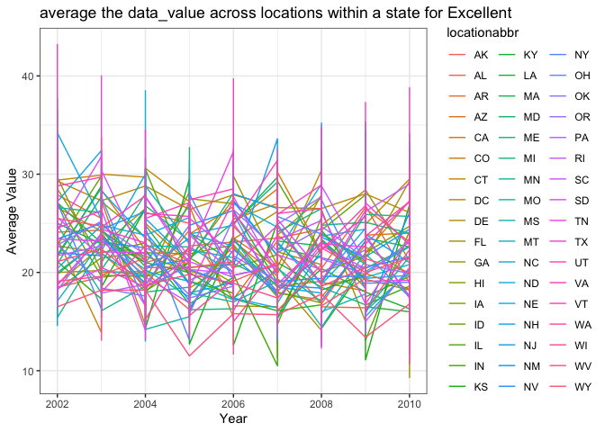
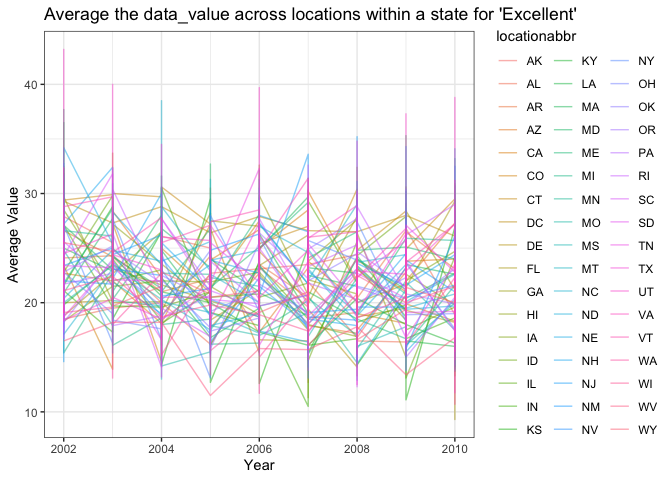

p8105_HW3
================
2023-10-13

# Problem 1

- load the dataset

``` r
library(p8105.datasets)
data("instacart")
instacart
```

    ## # A tibble: 1,384,617 × 15
    ##    order_id product_id add_to_cart_order reordered user_id eval_set order_number
    ##       <int>      <int>             <int>     <int>   <int> <chr>           <int>
    ##  1        1      49302                 1         1  112108 train               4
    ##  2        1      11109                 2         1  112108 train               4
    ##  3        1      10246                 3         0  112108 train               4
    ##  4        1      49683                 4         0  112108 train               4
    ##  5        1      43633                 5         1  112108 train               4
    ##  6        1      13176                 6         0  112108 train               4
    ##  7        1      47209                 7         0  112108 train               4
    ##  8        1      22035                 8         1  112108 train               4
    ##  9       36      39612                 1         0   79431 train              23
    ## 10       36      19660                 2         1   79431 train              23
    ## # ℹ 1,384,607 more rows
    ## # ℹ 8 more variables: order_dow <int>, order_hour_of_day <int>,
    ## #   days_since_prior_order <int>, product_name <chr>, aisle_id <int>,
    ## #   department_id <int>, aisle <chr>, department <chr>

- Number of aisles and most items ordered from

``` r
instacart |>
  count(aisle) |>
  arrange(desc(n))
```

    ## # A tibble: 134 × 2
    ##    aisle                              n
    ##    <chr>                          <int>
    ##  1 fresh vegetables              150609
    ##  2 fresh fruits                  150473
    ##  3 packaged vegetables fruits     78493
    ##  4 yogurt                         55240
    ##  5 packaged cheese                41699
    ##  6 water seltzer sparkling water  36617
    ##  7 milk                           32644
    ##  8 chips pretzels                 31269
    ##  9 soy lactosefree                26240
    ## 10 bread                          23635
    ## # ℹ 124 more rows

There are 134 aisles and fresh vegetables is the aisle that the most
items ordered from

- Plot that shows the number of items ordered in each aisle, limiting
  this to aisles with more than 10000 items ordered

``` r
instacart |>
  count(aisle) |>
  filter(n > 10000) |> 
  ggplot(aes(x = reorder(aisle, -n), y = n)) + geom_point() + labs(title = "Number of items ordered each aisle", x = "Aisle Name", y = "Number of items ordered") +       theme(axis.text.x = element_text(angle = 50, hjust = 1))
```

<!-- -->

- Making a table showing the three most popular items in each of the
  aisles “baking ingredients”, “dog food care”, and “packaged vegetables
  fruits”

``` r
instacart |>
  filter(aisle %in% c("baking ingredients", "dog food care",  "packaged vegetables fruits")) |>
  group_by(aisle) |>
  count(product_name) |>
  mutate(rank = min_rank(desc(n))) |>
  filter(rank < 4) |>
  arrange(desc(n)) |>
  knitr::kable()
```

| aisle                      | product_name                                  |    n | rank |
|:---------------------------|:----------------------------------------------|-----:|-----:|
| packaged vegetables fruits | Organic Baby Spinach                          | 9784 |    1 |
| packaged vegetables fruits | Organic Raspberries                           | 5546 |    2 |
| packaged vegetables fruits | Organic Blueberries                           | 4966 |    3 |
| baking ingredients         | Light Brown Sugar                             |  499 |    1 |
| baking ingredients         | Pure Baking Soda                              |  387 |    2 |
| baking ingredients         | Cane Sugar                                    |  336 |    3 |
| dog food care              | Snack Sticks Chicken & Rice Recipe Dog Treats |   30 |    1 |
| dog food care              | Organix Chicken & Brown Rice Recipe           |   28 |    2 |
| dog food care              | Small Dog Biscuits                            |   26 |    3 |

- Making a table showing the mean hour of the day at which Pink Lady
  Apples and Coffee Ice Cream are ordered on each day of the week

``` r
instacart |>
  filter(product_name %in% c("Pink Lady Apples", "Coffee Ice Cream")) |>
  group_by(product_name, order_dow) |>
  summarize(mean_hour = mean(order_hour_of_day)) |>
  pivot_wider(
    names_from = order_dow, 
    values_from = mean_hour) |>
  knitr::kable(digits = 2)
```

    ## `summarise()` has grouped output by 'product_name'. You can override using the
    ## `.groups` argument.

| product_name     |     0 |     1 |     2 |     3 |     4 |     5 |     6 |
|:-----------------|------:|------:|------:|------:|------:|------:|------:|
| Coffee Ice Cream | 13.77 | 14.32 | 15.38 | 15.32 | 15.22 | 12.26 | 13.83 |
| Pink Lady Apples | 13.44 | 11.36 | 11.70 | 14.25 | 11.55 | 12.78 | 11.94 |

# Probelm 2

- Loading the dataset

``` r
library(p8105.datasets)
data("brfss_smart2010")
```

- Doing some cleaning

``` r
brfss_df = 
  brfss_smart2010 |>
  janitor::clean_names ()|>
  filter(topic == "Overall Health",
         response %in% c("Poor", "Fair", "Good", "Very Good,", "Excellent")) |>
  mutate (response = factor(response, level = c("Poor", "Fair", "Good", "Very Good,", "Excellent", order = TRUE)))

brfss_df 
```

    ## # A tibble: 8,500 × 23
    ##     year locationabbr locationdesc     class topic question response sample_size
    ##    <int> <chr>        <chr>            <chr> <chr> <chr>    <fct>          <int>
    ##  1  2010 AL           AL - Jefferson … Heal… Over… How is … Excelle…          94
    ##  2  2010 AL           AL - Jefferson … Heal… Over… How is … Good             208
    ##  3  2010 AL           AL - Jefferson … Heal… Over… How is … Fair             107
    ##  4  2010 AL           AL - Jefferson … Heal… Over… How is … Poor              45
    ##  5  2010 AL           AL - Mobile Cou… Heal… Over… How is … Excelle…          91
    ##  6  2010 AL           AL - Mobile Cou… Heal… Over… How is … Good             224
    ##  7  2010 AL           AL - Mobile Cou… Heal… Over… How is … Fair             120
    ##  8  2010 AL           AL - Mobile Cou… Heal… Over… How is … Poor              66
    ##  9  2010 AL           AL - Tuscaloosa… Heal… Over… How is … Excelle…          58
    ## 10  2010 AL           AL - Tuscaloosa… Heal… Over… How is … Good             171
    ## # ℹ 8,490 more rows
    ## # ℹ 15 more variables: data_value <dbl>, confidence_limit_low <dbl>,
    ## #   confidence_limit_high <dbl>, display_order <int>, data_value_unit <chr>,
    ## #   data_value_type <chr>, data_value_footnote_symbol <chr>,
    ## #   data_value_footnote <chr>, data_source <chr>, class_id <chr>,
    ## #   topic_id <chr>, location_id <chr>, question_id <chr>, respid <chr>,
    ## #   geo_location <chr>

- Question: In 2002, which states were observed at 7 or more locations?
  What about in 2010?

``` r
brfss_df |> 
  filter (year == "2002") |> 
  group_by (year, locationabbr) |> 
  summarize (locations = n_distinct(locationdesc)) |> 
  filter (locations >= 7) 
```

    ## `summarise()` has grouped output by 'year'. You can override using the
    ## `.groups` argument.

    ## # A tibble: 6 × 3
    ## # Groups:   year [1]
    ##    year locationabbr locations
    ##   <int> <chr>            <int>
    ## 1  2002 CT                   7
    ## 2  2002 FL                   7
    ## 3  2002 MA                   8
    ## 4  2002 NC                   7
    ## 5  2002 NJ                   8
    ## 6  2002 PA                  10

In 2002, CT, FL, MA, NC, NJ, and PA, total 6 states were observed at 7
or more locations

``` r
brfss_df |> 
  filter (year == "2010") |> 
  group_by (year, locationabbr) |> 
  summarize (locations = n_distinct(locationdesc)) |> 
  filter (locations >= 7) 
```

    ## `summarise()` has grouped output by 'year'. You can override using the
    ## `.groups` argument.

    ## # A tibble: 14 × 3
    ## # Groups:   year [1]
    ##     year locationabbr locations
    ##    <int> <chr>            <int>
    ##  1  2010 CA                  12
    ##  2  2010 CO                   7
    ##  3  2010 FL                  41
    ##  4  2010 MA                   9
    ##  5  2010 MD                  12
    ##  6  2010 NC                  12
    ##  7  2010 NE                  10
    ##  8  2010 NJ                  19
    ##  9  2010 NY                   9
    ## 10  2010 OH                   8
    ## 11  2010 PA                   7
    ## 12  2010 SC                   7
    ## 13  2010 TX                  16
    ## 14  2010 WA                  10

In 2002, CA, CO, FL, MA, MD, NC, NE, NJ, NY, OH, PA, SC, TX, and WA,
total 14 states were observed at 7 or more locations

- Construct a dataset that is limited to Excellent responses, and
  contains, year, state, and a variable that averages the data_value
  across locations within a state

- Making a “spaghetti” plot

``` r
brfss_df |>
  filter(response == "Excellent") |>
  group_by(year, locationabbr, locationdesc) |>
  summarize(average_data_value = mean(data_value)) |> 
  ggplot(aes(x = year, y = average_data_value, group = locationabbr, color = locationabbr)) + geom_line() + labs(
    title = "average the data_value across locations within a state for Excellent",
    x = "Year",
    y = "Average Value") + theme_bw()
```

    ## `summarise()` has grouped output by 'year', 'locationabbr'. You can override
    ## using the `.groups` argument.

<!-- -->

- Make a two-panel plot showing, for the years 2006, and 2010,
  distribution of data_value for responses (“Poor” to “Excellent”) among
  locations in NY State.

``` r
brfss_df |>
  filter(locationabbr == "NY") |>
  filter(year %in% c("2006", "2010")) |>
  ggplot(aes(x = response, y = data_value, group = locationabbr, color = locationabbr)) + geom_boxplot() + facet_grid(. ~ year) + labs (
    title = "Distribution of data_value for responses for 2006 and 2010",
    x = "Response",
    y = "Data Value",
    color = "Location"
  )
```

<!-- -->
