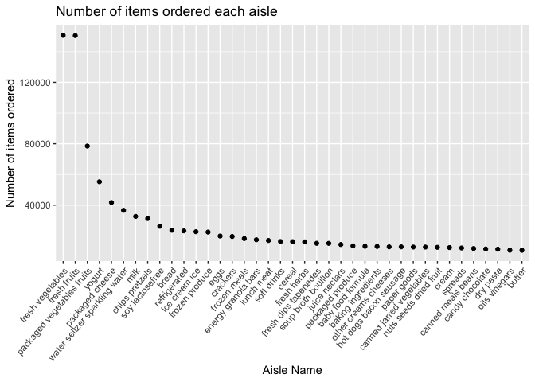

p8105_HW3
================
2023-10-13

## Problem 1

### load the dataset

``` r
library(p8105.datasets)
data("instacart")
instacart
```

    ## # A tibble: 1,384,617 × 15
    ##    order_id product_id add_to_cart_order reordered user_id eval_set order_number
    ##       <int>      <int>             <int>     <int>   <int> <chr>           <int>
    ##  1        1      49302                 1         1  112108 train               4
    ##  2        1      11109                 2         1  112108 train               4
    ##  3        1      10246                 3         0  112108 train               4
    ##  4        1      49683                 4         0  112108 train               4
    ##  5        1      43633                 5         1  112108 train               4
    ##  6        1      13176                 6         0  112108 train               4
    ##  7        1      47209                 7         0  112108 train               4
    ##  8        1      22035                 8         1  112108 train               4
    ##  9       36      39612                 1         0   79431 train              23
    ## 10       36      19660                 2         1   79431 train              23
    ## # ℹ 1,384,607 more rows
    ## # ℹ 8 more variables: order_dow <int>, order_hour_of_day <int>,
    ## #   days_since_prior_order <int>, product_name <chr>, aisle_id <int>,
    ## #   department_id <int>, aisle <chr>, department <chr>

### Numbr of aisles and most items ordered from

``` r
instacart |>
  count(aisle) |>
  arrange(desc(n))
```

    ## # A tibble: 134 × 2
    ##    aisle                              n
    ##    <chr>                          <int>
    ##  1 fresh vegetables              150609
    ##  2 fresh fruits                  150473
    ##  3 packaged vegetables fruits     78493
    ##  4 yogurt                         55240
    ##  5 packaged cheese                41699
    ##  6 water seltzer sparkling water  36617
    ##  7 milk                           32644
    ##  8 chips pretzels                 31269
    ##  9 soy lactosefree                26240
    ## 10 bread                          23635
    ## # ℹ 124 more rows

#### There are 134 aisles and fresh vegetables is the aisle that the most items ordered from

### Plot that shows the number of items ordered in each aisle, limiting this to aisles with more than 10000 items ordered

``` r
instacart |>
  count(aisle) |>
  filter(n > 10000) |> 
  ggplot(aes(x = reorder(aisle, -n), y = n)) + geom_point() + labs(title = "Number of items ordered each aisle", x = "Aisle Name", y = "Number of items ordered") +       theme(axis.text.x = element_text(angle = 50, hjust = 1))
```

<!-- --> \###
Making a table showing the three most popular items in each of the
aisles “baking ingredients”, “dog food care”, and “packaged vegetables
fruits”

``` r
instacart |>
  filter(aisle %in% c("baking ingredients", "dog food care",  "packaged vegetables fruits")) |>
  group_by(aisle) |>
  count(product_name) |>
  mutate(rank = min_rank(desc(n))) |>
  filter(rank < 4) |>
  arrange(desc(n)) |>
  knitr::kable()
```

| aisle                      | product_name                                  |    n | rank |
|:---------------------------|:----------------------------------------------|-----:|-----:|
| packaged vegetables fruits | Organic Baby Spinach                          | 9784 |    1 |
| packaged vegetables fruits | Organic Raspberries                           | 5546 |    2 |
| packaged vegetables fruits | Organic Blueberries                           | 4966 |    3 |
| baking ingredients         | Light Brown Sugar                             |  499 |    1 |
| baking ingredients         | Pure Baking Soda                              |  387 |    2 |
| baking ingredients         | Cane Sugar                                    |  336 |    3 |
| dog food care              | Snack Sticks Chicken & Rice Recipe Dog Treats |   30 |    1 |
| dog food care              | Organix Chicken & Brown Rice Recipe           |   28 |    2 |
| dog food care              | Small Dog Biscuits                            |   26 |    3 |

### Making a table showing the mean hour of the day at which Pink Lady Apples and Coffee Ice Cream are ordered on each day of the week

``` r
instacart |>
  filter(product_name %in% c("Pink Lady Apples", "Coffee Ice Cream")) |>
  group_by(product_name, order_dow) |>
  summarize(mean_hour = mean(order_hour_of_day)) |>
  pivot_wider(
    names_from = order_dow, 
    values_from = mean_hour) |>
  knitr::kable(digits = 2)
```

    ## `summarise()` has grouped output by 'product_name'. You can override using the
    ## `.groups` argument.

| product_name     |     0 |     1 |     2 |     3 |     4 |     5 |     6 |
|:-----------------|------:|------:|------:|------:|------:|------:|------:|
| Coffee Ice Cream | 13.77 | 14.32 | 15.38 | 15.32 | 15.22 | 12.26 | 13.83 |
| Pink Lady Apples | 13.44 | 11.36 | 11.70 | 14.25 | 11.55 | 12.78 | 11.94 |
