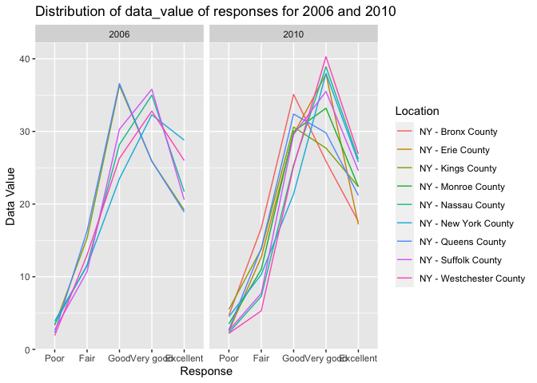
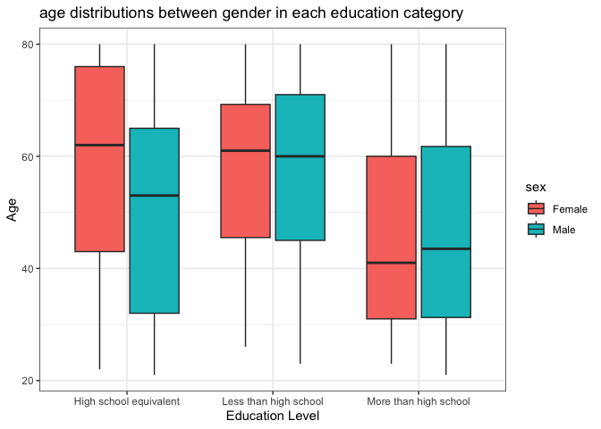
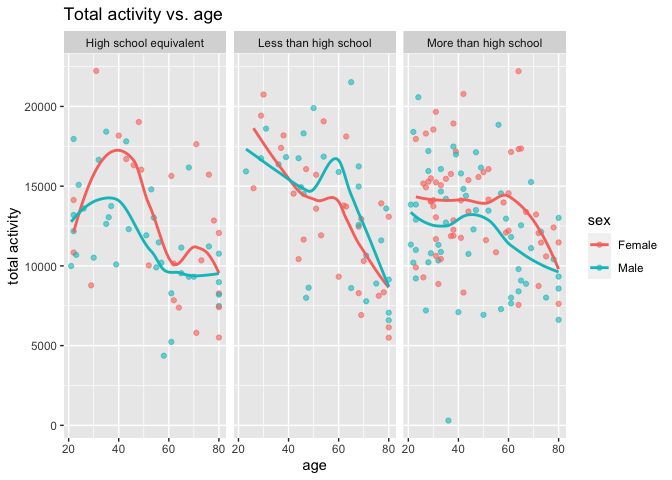
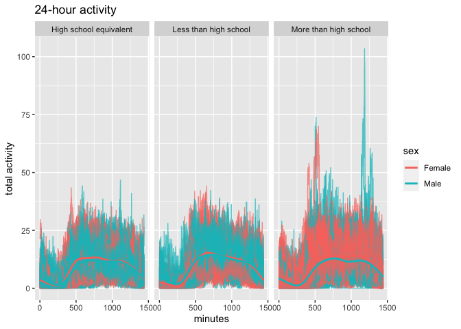

p8105_HW3
================
2023-10-13

# Problem 1

- load the dataset

``` r
library(p8105.datasets)
data("instacart")
```

- Number of aisles and most items ordered from

``` r
instacart |>
  count(aisle) |>
  arrange(desc(n))
```

    ## # A tibble: 134 × 2
    ##    aisle                              n
    ##    <chr>                          <int>
    ##  1 fresh vegetables              150609
    ##  2 fresh fruits                  150473
    ##  3 packaged vegetables fruits     78493
    ##  4 yogurt                         55240
    ##  5 packaged cheese                41699
    ##  6 water seltzer sparkling water  36617
    ##  7 milk                           32644
    ##  8 chips pretzels                 31269
    ##  9 soy lactosefree                26240
    ## 10 bread                          23635
    ## # ℹ 124 more rows

There are 134 aisles and fresh vegetables is the aisle that the most
items ordered from.

- Plot that shows the number of items ordered in each aisle, limiting
  this to aisles with more than 10000 items ordered

``` r
instacart |>
  count(aisle) |>
  filter(n > 10000) |> 
  ggplot(aes(x = reorder(aisle, -n), y = n)) + 
  geom_point() + 
  labs(title = "Number of items ordered each aisle", x = "Aisle Name", y = "Number of items ordered") +       
  theme(axis.text.x = element_text(angle = 50, hjust = 1))
```

<!-- -->

- Making a table showing the three most popular items in each of the
  aisles “baking ingredients”, “dog food care”, and “packaged vegetables
  fruits”

``` r
instacart |>
  filter(aisle %in% c("baking ingredients", "dog food care",  "packaged vegetables fruits")) |>
  group_by(aisle) |>
  count(product_name) |>
  mutate(rank = min_rank(desc(n))) |>
  filter(rank < 4) |>
  arrange(desc(n)) |>
  knitr::kable()
```

| aisle                      | product_name                                  |    n | rank |
|:---------------------------|:----------------------------------------------|-----:|-----:|
| packaged vegetables fruits | Organic Baby Spinach                          | 9784 |    1 |
| packaged vegetables fruits | Organic Raspberries                           | 5546 |    2 |
| packaged vegetables fruits | Organic Blueberries                           | 4966 |    3 |
| baking ingredients         | Light Brown Sugar                             |  499 |    1 |
| baking ingredients         | Pure Baking Soda                              |  387 |    2 |
| baking ingredients         | Cane Sugar                                    |  336 |    3 |
| dog food care              | Snack Sticks Chicken & Rice Recipe Dog Treats |   30 |    1 |
| dog food care              | Organix Chicken & Brown Rice Recipe           |   28 |    2 |
| dog food care              | Small Dog Biscuits                            |   26 |    3 |

- Making a table showing the mean hour of the day at which Pink Lady
  Apples and Coffee Ice Cream are ordered on each day of the week

``` r
instacart |>
  filter(product_name %in% c("Pink Lady Apples", "Coffee Ice Cream")) |>
  group_by(product_name, order_dow) |>
  summarize(mean_hour = mean(order_hour_of_day)) |>
  pivot_wider(
    names_from = order_dow, 
    values_from = mean_hour) |>
  knitr::kable(digits = 2)
```

    ## `summarise()` has grouped output by 'product_name'. You can override using the
    ## `.groups` argument.

| product_name     |     0 |     1 |     2 |     3 |     4 |     5 |     6 |
|:-----------------|------:|------:|------:|------:|------:|------:|------:|
| Coffee Ice Cream | 13.77 | 14.32 | 15.38 | 15.32 | 15.22 | 12.26 | 13.83 |
| Pink Lady Apples | 13.44 | 11.36 | 11.70 | 14.25 | 11.55 | 12.78 | 11.94 |

# Probelm 2

- Loading the dataset

``` r
library(p8105.datasets)
data("brfss_smart2010")
```

- Doing some cleaning

``` r
brfss_df = 
  brfss_smart2010 |> 
  janitor::clean_names() |> 
  filter( 
    topic == "Overall Health",
    response %in% c("Poor", "Fair", "Good", "Very good", "Excellent")) |> 
  mutate(response = factor(response, levels = c("Poor", "Fair", "Good", "Very good", "Excellent"), ordered = TRUE))
```

- Question: In 2002, which states were observed at 7 or more locations?
  What about in 2010?

``` r
brfss_df |> 
  filter (year == "2002") |> 
  group_by (year, locationabbr) |> 
  summarize (locations = n_distinct(locationdesc)) |> 
  filter (locations >= 7) 
```

    ## `summarise()` has grouped output by 'year'. You can override using the
    ## `.groups` argument.

    ## # A tibble: 6 × 3
    ## # Groups:   year [1]
    ##    year locationabbr locations
    ##   <int> <chr>            <int>
    ## 1  2002 CT                   7
    ## 2  2002 FL                   7
    ## 3  2002 MA                   8
    ## 4  2002 NC                   7
    ## 5  2002 NJ                   8
    ## 6  2002 PA                  10

In 2002, CT, FL, MA, NC, NJ, and PA, total 6 states were observed at 7
or more locations

``` r
brfss_df |> 
  filter (year == "2010") |> 
  group_by (year, locationabbr) |> 
  summarize (locations = n_distinct(locationdesc)) |> 
  filter (locations >= 7) 
```

    ## `summarise()` has grouped output by 'year'. You can override using the
    ## `.groups` argument.

    ## # A tibble: 14 × 3
    ## # Groups:   year [1]
    ##     year locationabbr locations
    ##    <int> <chr>            <int>
    ##  1  2010 CA                  12
    ##  2  2010 CO                   7
    ##  3  2010 FL                  41
    ##  4  2010 MA                   9
    ##  5  2010 MD                  12
    ##  6  2010 NC                  12
    ##  7  2010 NE                  10
    ##  8  2010 NJ                  19
    ##  9  2010 NY                   9
    ## 10  2010 OH                   8
    ## 11  2010 PA                   7
    ## 12  2010 SC                   7
    ## 13  2010 TX                  16
    ## 14  2010 WA                  10

In 2002, CA, CO, FL, MA, MD, NC, NE, NJ, NY, OH, PA, SC, TX, and WA,
total 14 states were observed at 7 or more locations

- Construct a dataset that is limited to Excellent responses, and
  contains, year, state, and a variable that averages the data_value
  across locations within a state

``` r
excellent_response_df = 
  brfss_df |>
  filter(response == "Excellent") |>
  group_by(year, locationabbr, locationdesc) |>
  summarize(average_data_value = mean(data_value))
```

    ## `summarise()` has grouped output by 'year', 'locationabbr'. You can override
    ## using the `.groups` argument.

- Making a “spaghetti” plot

``` r
excellent_response_df |>
  ggplot(aes(x = year, y = average_data_value, group = locationabbr, color = locationabbr)) +
  geom_line(alpha = 0.5) +
  labs(
    title = "Average the data_value across locations within a state for 'Excellent'",
    x = "Year",
    y = "Average Value") +
    theme_bw()
```

<!-- -->

The plot shows the average percent of responses in the “Excellent”
category. The responses range from around 10% to 45% of “Excellent”
response. The average of “excellent” response stays around 25% from 2002
to 2010.

- Make a two-panel plot showing, for the years 2006, and 2010,
  distribution of data_value for responses (“Poor” to “Excellent”) among
  locations in NY State.

``` r
brfss_df |>
  filter(locationabbr == "NY", 
         year %in% c("2006", "2010")) |>
  ggplot(aes(x = response, y = data_value, group = locationdesc, color = locationdesc)) + 
  geom_line() + 
  facet_grid(. ~ year) + 
  labs (
    title = "Distribution of data_value of responses for 2006 and 2010",
    x = "Response",
    y = "Data Value",
    color = "Location"
  )
```

<!-- -->

The plot shows the distribution of responses in NY for 2006 and 2010.
The distributation is similar across different years. More locations
were added in the 2010 distribution. In 2006, the greatest number of
responses come from “Good”. However, in 2010, there are more “very good”
responses.

# Problem 3

- loading the demographic dataset and clean

``` r
demo_df = read_csv("./nhanes_covar.csv", skip = 4) |> 
  janitor::clean_names() |> 
  filter(age >= "21") |>
  drop_na() |>
  mutate(
    sex = case_match(
    sex, 
    1 ~ "Male", 
    2 ~ "Female"),
    sex = as.factor(sex),
    education = case_match(
    education, 
    1 ~ "Less than high school", 
    2 ~ "High school equivalent", 
    3 ~ "More than high school"
  ),
  education = as.factor(education))
```

    ## Rows: 250 Columns: 5
    ## ── Column specification ────────────────────────────────────────────────────────
    ## Delimiter: ","
    ## dbl (5): SEQN, sex, age, BMI, education
    ## 
    ## ℹ Use `spec()` to retrieve the full column specification for this data.
    ## ℹ Specify the column types or set `show_col_types = FALSE` to quiet this message.

- loading the accelerometer dataset

``` r
accel_df=read_csv("./nhanes_accel.csv") |>
  janitor::clean_names() |>
  pivot_longer(
  min1:min1440,
  names_to = "time",
  values_to = "accel_minutes",
  names_prefix = "min"
 ) 
```

    ## Rows: 250 Columns: 1441
    ## ── Column specification ────────────────────────────────────────────────────────
    ## Delimiter: ","
    ## dbl (1441): SEQN, min1, min2, min3, min4, min5, min6, min7, min8, min9, min1...
    ## 
    ## ℹ Use `spec()` to retrieve the full column specification for this data.
    ## ℹ Specify the column types or set `show_col_types = FALSE` to quiet this message.

- merge demographic and accelerometer datasets

``` r
merge_nhanes = left_join(demo_df, accel_df, by = "seqn") |>
  mutate(time= as.numeric(time))
```

- Produce a reader-friendly table for the number of men and women in
  each education category, and create a visualization of the age
  distributions for men and women in each education category

``` r
merge_nhanes |> 
  group_by(sex, education) |> 
  summarize(count = n()) |> 
  pivot_wider(names_from = education, values_from = count) |> 
  knitr::kable()
```

    ## `summarise()` has grouped output by 'sex'. You can override using the `.groups`
    ## argument.

| sex    | High school equivalent | Less than high school | More than high school |
|:-------|-----------------------:|----------------------:|----------------------:|
| Female |                  33120 |                 40320 |                 84960 |
| Male   |                  50400 |                 38880 |                 80640 |

According to the table, the biggest difference between women and men is
shown for people who have high school equivalent education. More
participants involoved are from people who have more than high school
education.

- Visualization

``` r
ggplot(merge_nhanes, aes(x = education, y = age, fill = sex)) +
  geom_boxplot() + 
  labs(title = "age distributions between gender in each education category",
       x = "Education Level",
       y = "Age") +
  theme_bw() 
```

<!-- -->

Comments:

From the table and plot, most participants in this study have an
education of high school equivalent. There are more male participant
than female among people with hgih school equivalent education.

- aggregate across minutes to create a total activity variable for each
  participant.

``` r
total_activity_df= 
  merge_nhanes |>
  group_by(seqn, sex, age, education) |>
  summarize(total_activity = sum(accel_minutes))
```

    ## `summarise()` has grouped output by 'seqn', 'sex', 'age'. You can override
    ## using the `.groups` argument.

- Plot these total activities (y-axis) against age (x-axis); your plot
  should compare men to women and have separate panels for each
  education level. Include a trend line or a smooth to illustrate
  differences

``` r
total_activity_df |>
  ggplot(aes(x = age, y = total_activity, color = sex)) +
  geom_point(alpha = 0.6) +
  geom_smooth (se= FALSE) +
  facet_grid(. ~ education) +
  labs(
    title = "Total activity vs. age",
    x = "age",
    y = "total activity"
  )
```

    ## `geom_smooth()` using method = 'loess' and formula = 'y ~ x'

<!-- -->

Comments:

From the plot, we can see the relationship between total activities and
age divided by different education level. The trend line shows a
nonlinear relationship between variables. Total activities decrease with
the increase in age across all groups. Women tend to have more physical
activity for “more than high school” education level. Overall, people
with “more than high school” education level have more physical activity
than other cateogries.

- Make a three-panel plot that shows the 24-hour activity time courses
  for each education level and use color to indicate sex. Describe in
  words any patterns or conclusions you can make based on this graph;
  including smooth trends may help identify differences.

``` r
merge_nhanes |>
  ggplot(aes(x= time, y = accel_minutes, group = seqn, color = sex)) +
  geom_line(alpha = 0.7) +
  geom_smooth(aes(group = sex), se = FALSE) +
  facet_grid(. ~education) +
  labs(
    title = "24-hour activity",
    x = "minutes",
    y = "total activity"
  )
```

    ## `geom_smooth()` using method = 'gam' and formula = 'y ~ s(x, bs = "cs")'

<!-- -->

Comments:

Based on the plot, people across all levels of education tend to have
similar trend of activity during 24 hours period of time. The activity
decreases from 0 minute to 250 minutes, increases from 250 minutes to
about 1000 minutes, and decreases again. The trend fulfills the pattern
of people’s normal daily activity trend. Noticeably, men with more than
high school education have the most activities at around 1150 minutes
than other groups.
